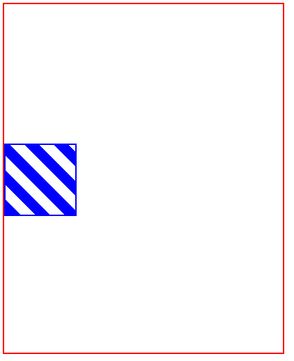
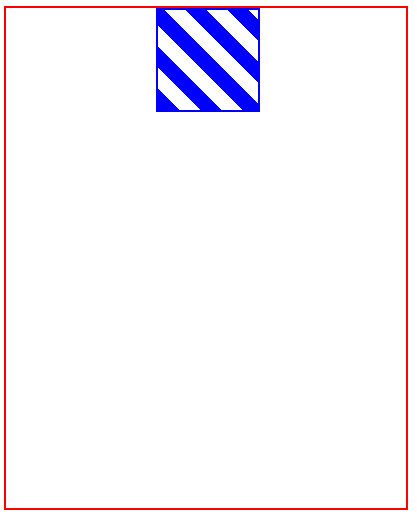
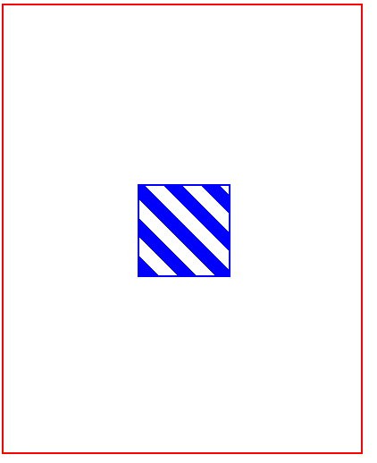

 CSS-center

<h3>Example:</h3>
<br>
<h4>Vertical Alignment</h4>

```html
<div class = "outer-vert">
  <div class = "inner-vert">
  </div>
</div>
```



<h4>Horizontal Alignment</h4>

```html
<div class = "outer-hori">
  <div class = "inner-hori">
  </div>
</div>
```



<h4>Horizontal and Vertical Alignment</h4>
 
```html
<div class = "outer-hori outer-vert">
  <div class = "inner-hori outer-vert">
  </div>
</div>
```

